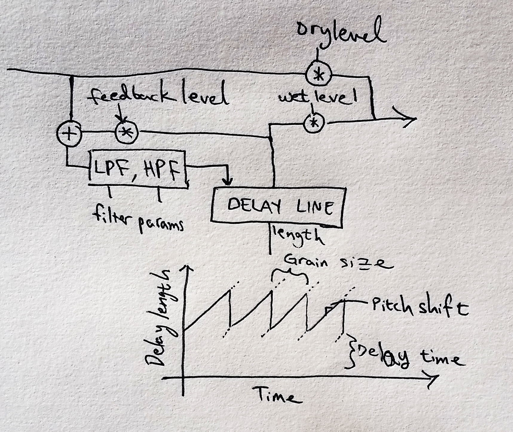

# Splutter

Spiraling, chaotic pitch shifting delays. Spooky, bubbling diminished chords. Laser-gun sounds. Indistinct growling. Sparkling overtones. Another plug-in that does that? Yawn.

## Implementation details

This effect uses a variable delay length, moving in a sawtooth pattern to create a jittery, pitch-shifted delay. The discontinuity at the end of the sawtooth wave is softened by fading from the top of the sawtooth to the bottom over a fixed number of samples. 

## Future improvements

Some considerations for the future:

Make a knob for size of smoothing window-- at long grain sizes, the current setting (a fixed value of 1000 samples) is pretty jerky.

Put EQ at the end? Putting it at the start can give some unexpected results-- it can make it feel like the EQ isn't "working" right away when there's a long delay.

Certain EQ settings can create feedback loops at high feedback levels. Fix this (maybe with a lower Q value on the EQ?), or buyer beware?

The overall graphic design could use some work. And the algorithms are still pretty messy. And there's some dreaded clicking on the pitch shift and grain size knobs.